[**Check out this project on my GitHub**](https://github.com/vienvuong/colorizing-pg)

## Introduction

Sergei Mikhailovich Prokudin-Gorskii (1863-1944) was a photographer who, between the years 1909-1915, traveled the Russian empire and took thousands of photos of everything he saw. He used an early color technology that involved recording three exposures of every scene onto a glass plate using a red, green, and blue filter. Back then, there was no way to print such photos, and they had to be displayed using a special projector. Prokudin-Gorskii left Russia in 1918. His glass plate negatives survived and were purchased by the Library of Congress in 1948. Today, a digitized version of the Prokudin-Gorskii collection is available online.

This project takes the digitized Prokudin-Gorskii glass plate images and automatically produces a color image with as few visual artifacts as possible. To achieve this, I extract the three color channel images, place them on top of each other, and align them so that they form a single RGB color image.

## Cropping the Monochromatic Images

To allow manual cropping, the program prompts the user to manually crop each of the 3 monochromatic images corresponding to the Blue, Green, and Red channels in that order.

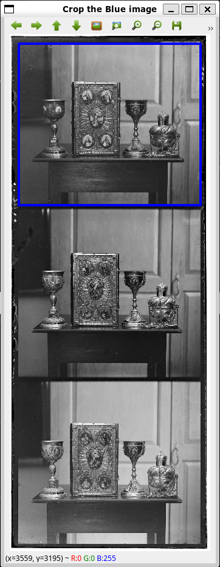

Now that we have the 3 channels, we have to align two of the channels to the third to construct the color image.

## Basic Alignment (Naive Search)

The easiest way to align the parts is to exhaustively search over a window of possible displacements (say [-15,15] pixels independently for the x and y axis), score each one using some image matching metric, and take the displacement with the best score.

There is a number of possible metrics that one could use to score how well the images match. The most basic one is the L2 norm of the pixel differences of the two channels, also known as the sum of squared differences (SSD) for images loaded as NumPy arrays.

**SSD (Sum of Squared Differences):**

$$ SSD(\vec{x}, \vec{y}) = \sum*{i}\sum*{j}(\vec{x}\_{i,j} - \vec{y}\_{i,j})^2 $$

Note that in our case, the images to be matched do not actually have the same brightness values (they are different color channels), so a cleverer metric might work better. One such possibility is normalized cross-correlation (NCC), which is simply the dot product between the two images normalized to have zero mean and unit norm. NCC has the advantage of being more robust to change in global brightness, but it is also slower than SSD.

**NCC (Normalized Cross Correlation):**

$$ NCC(\vec{x}, \vec{y}) = \langle\frac{\vec{x}}{||\vec{x}||}, \frac{\vec{y}}{||\vec{y}||}\rangle $$

## Multiscale Alignment (Pyramid Search)

For the high-resolution glass plate scans, exhaustive search over all possible displacements will become prohibitively expensive. To deal with this case, I implemented a faster search procedure using an image pyramid. An image pyramid represents the image at multiple scales (usually scaled by a factor of 2) and the processing is done sequentially starting from the coarsest scale (smallest image) and going down the pyramid, updating your estimate as you go.

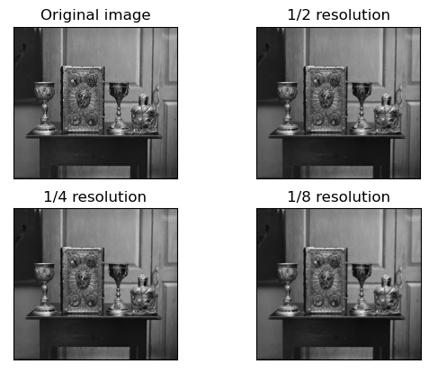

A more intuitive view of the image pyramid:

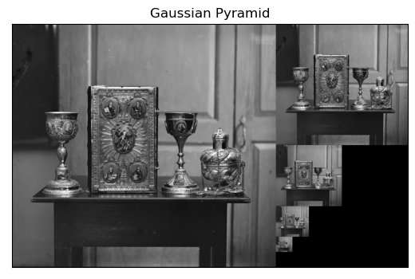

We would start at the smallest scale (1/8 resolution) and align each of the Green and Red channels to Blue. We save the 2 displacement (alignment) vectors, and upscales them so they can be applied to the next level in the pyramid (1/4 resolution). Then we recursively align the next smallest level until we get to the full resolution images.

Multiscale alignment also results in a significant speed up. Naive search for a high-resolution image with a (-30, 30) search space in both X-Y directions takes around 12 minutes and produces a bad alignment. Pyramid search takes 5 minutes and produces a much better alignment.

### Problems with this approach

While this stereo matching method works well for some images:

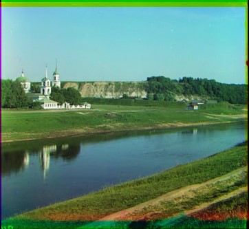

It completely fails for others:

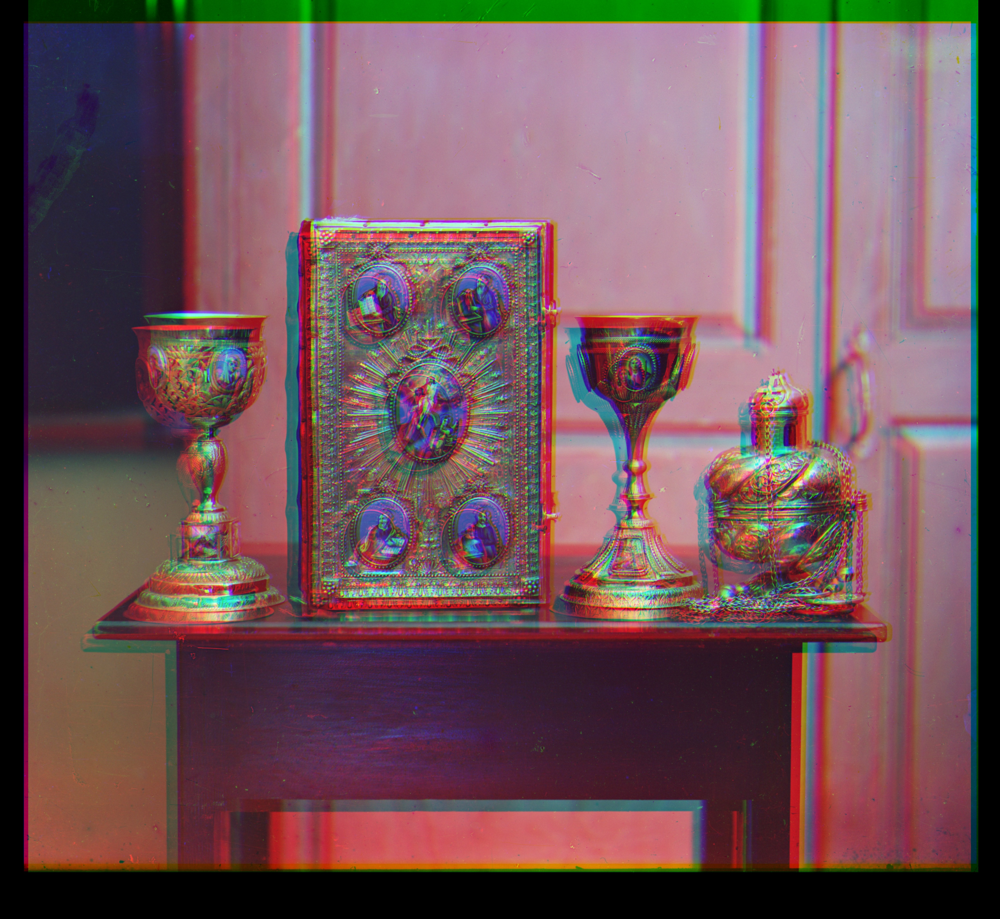

## Improvement: Only align edges

Current method focuses on comparing the brightnesses between the channels. However, since brightness is an issue, we can pass the image through an edge detection filter to remove brightness from the equation. There are multiple ways to find edges in an image. I choose to use the Canny edge detector because it is quite sophisticated.

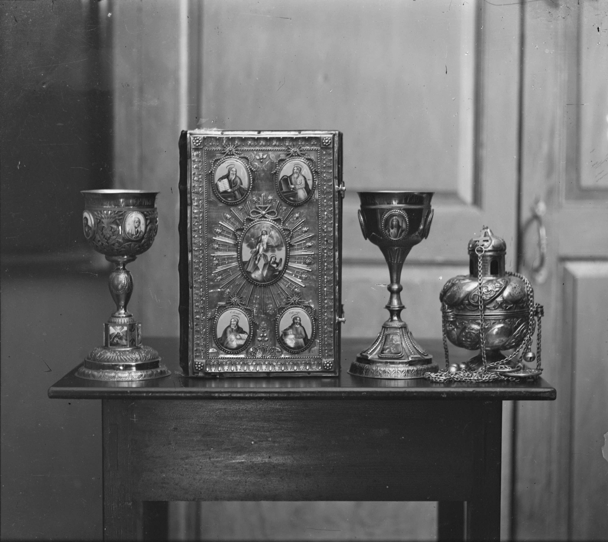
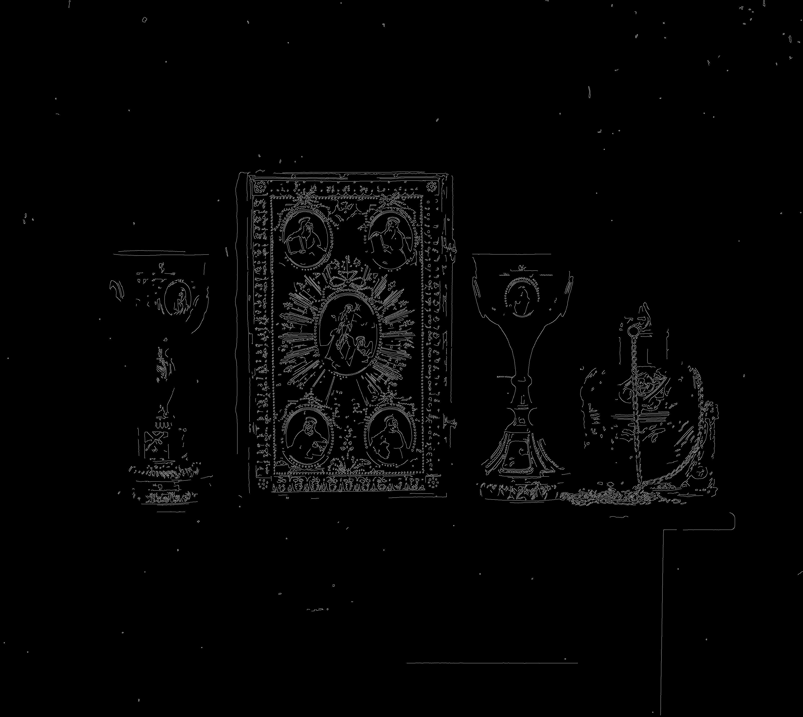

Apply the same Pyramid Search algorithm:

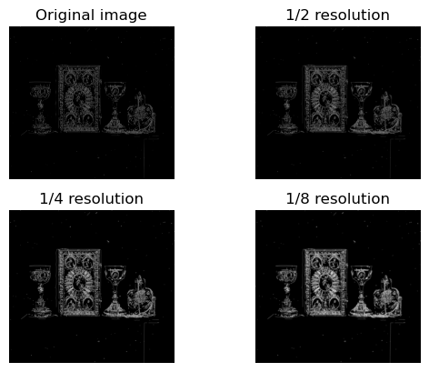
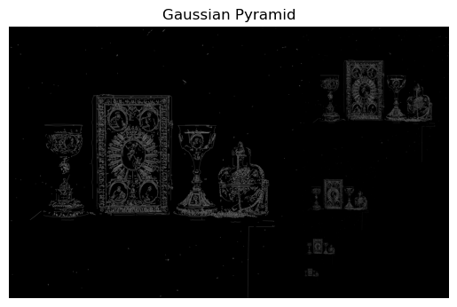

Now if I colorize the image again, the result is much better:

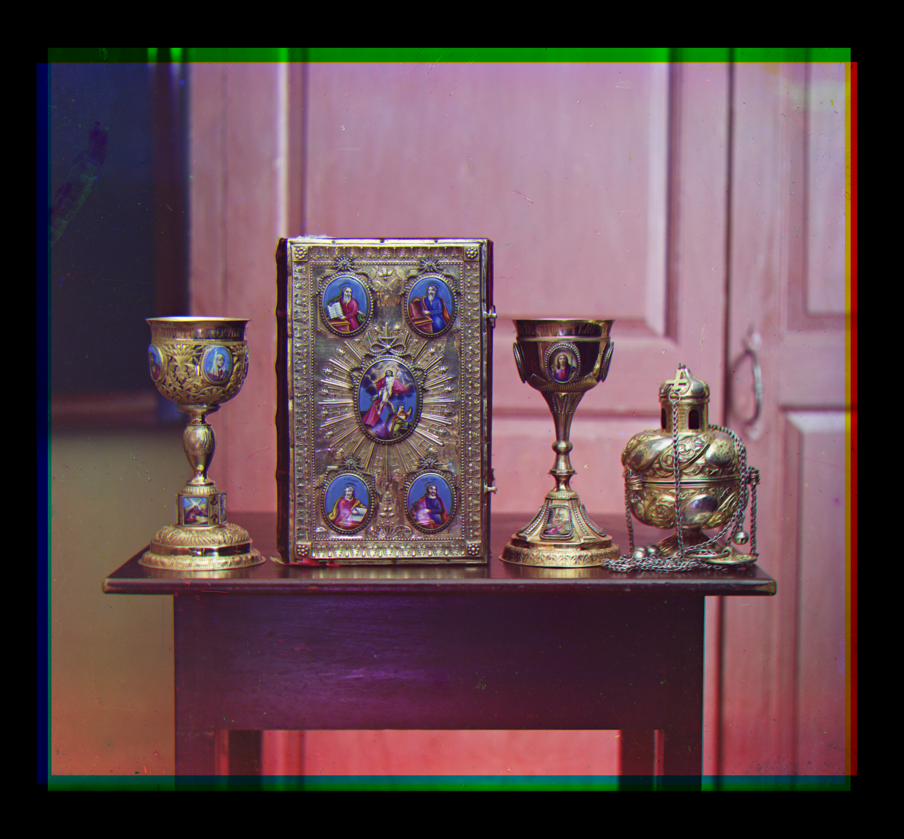

## Improvement: Crop out the strange color border

The borders of the photograph will have strange colors since the three channels won't exactly align. I solved this problem by computing the mean brightness of each channel for each row and column. At the border rows and columns, if one or more of the channel is almost completely dark (mean < 0.5), I crop out that row or column.

Now let's try with our previous result:

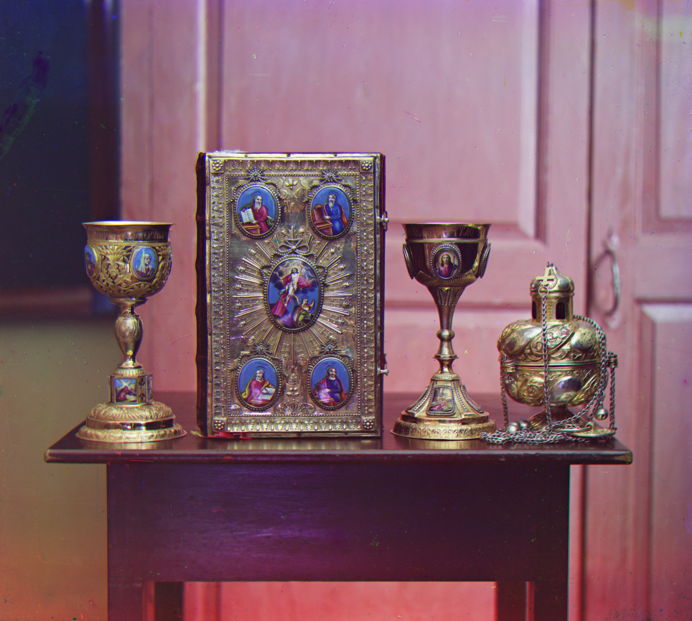

## Improvement: Use cv2.matchTemplate() to speed up alignment

cv2.matchTemplate() is much faster than our Multiscale Search method and more robust to monochromatic channel images with large discrepencies.

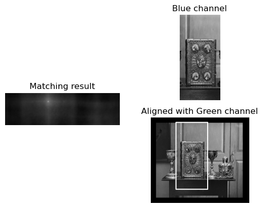
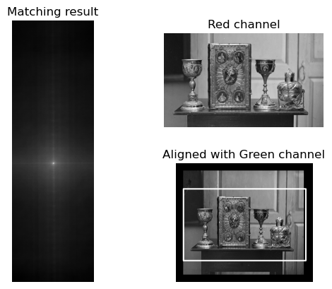
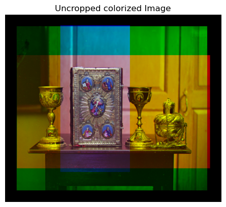
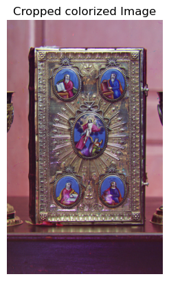

## More Results

Green: $(21, -23)$, Red: $(36, 19)$

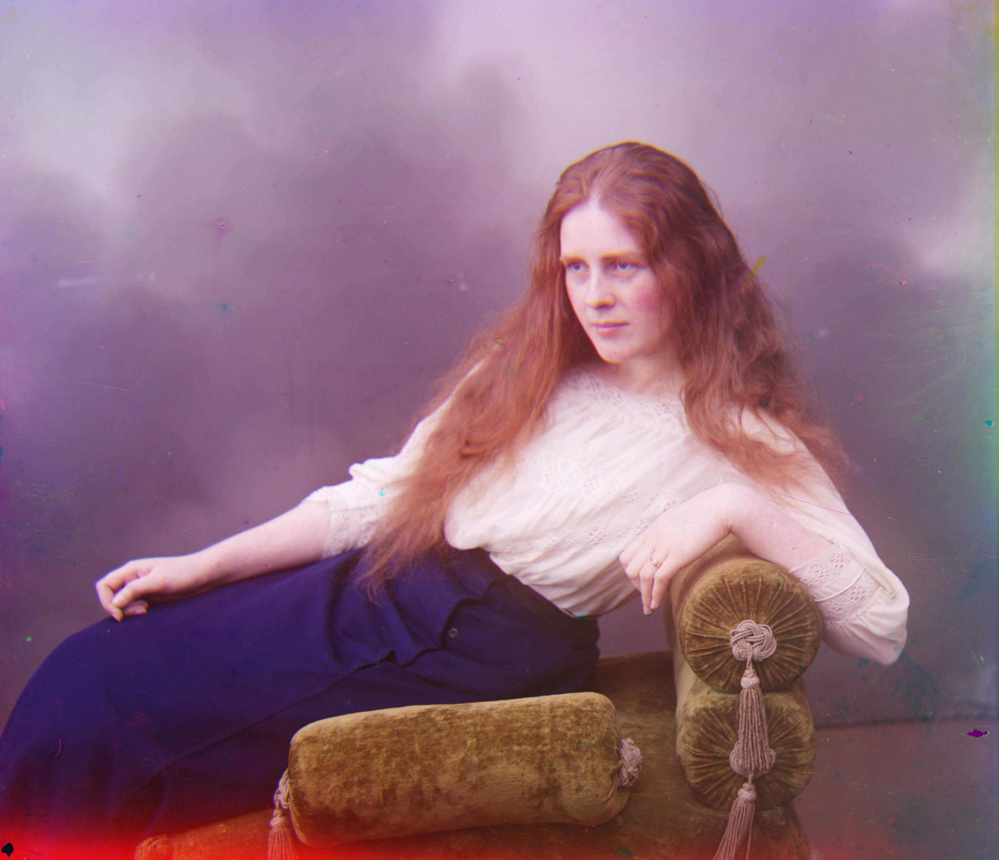

Green: $(28, -105)$, Red: $(39, -50)$

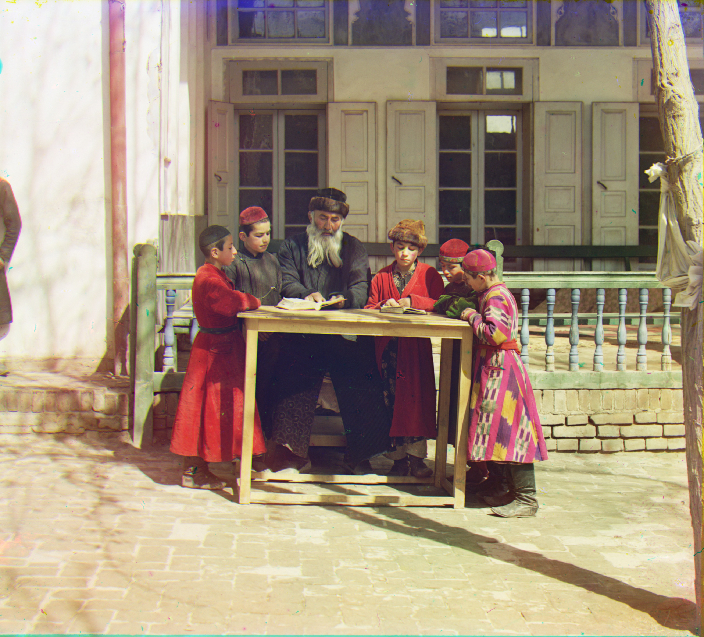

Green: $(2, -9)$, Red: $(1, -4)$

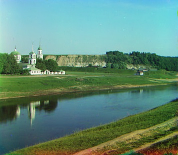

Green: $(11, 0)$, Red: $(11, 7)$

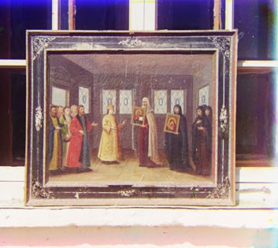

Green: $(12, -9)$, Red: $(14, -4)$

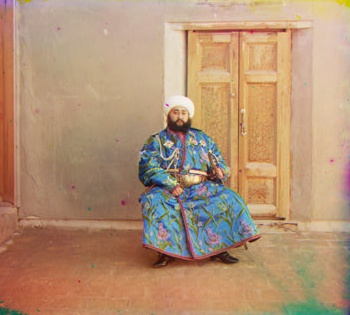

Green: $(3, -14)$, Red: $(3, -9)$

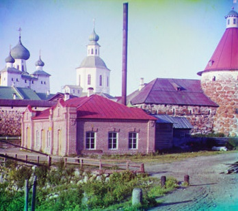

Green: $(4, -14)$, Red: $(3, -8)$

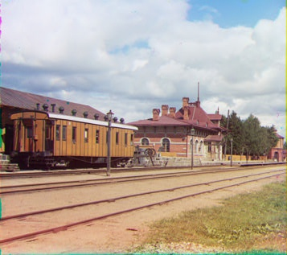

Green: $(-2, -16)$, Red: $(-4, -10)$

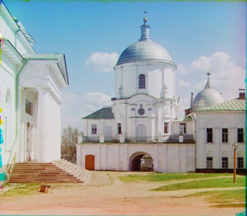
