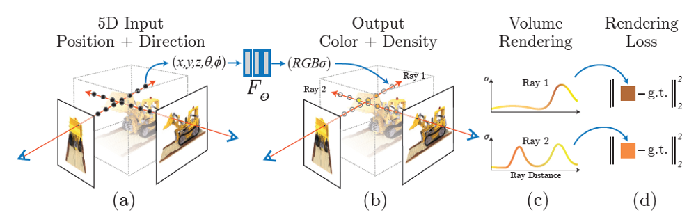
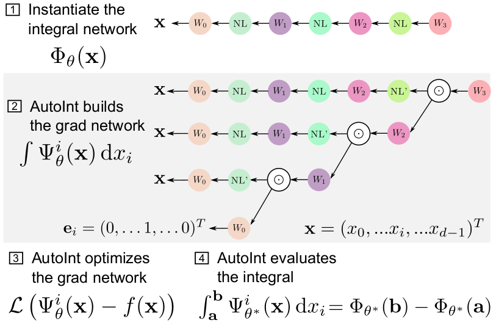
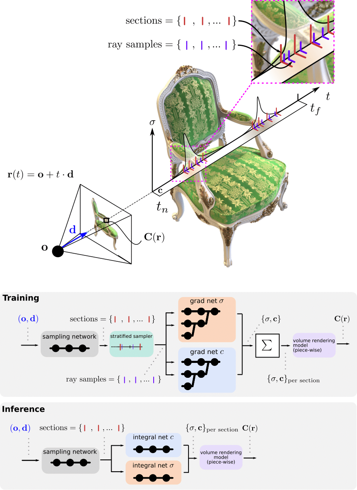

**Author:** Vien Vuong (vienv2)

## Introduction

### Neural Radiance Fields

After causing a big splash in ECCV 2020, the impressive NeRF paper by Mildenhall et al. has kickstarted an explosion in research in the field of neural volume rendering. It is a novel, data-driven approach that provides an efficient synthesis of visually compelling novel scenes from input images or videos.

NeRF also allows explicit or implicit control of scene properties such as illumination, camera parameters, pose, geometry, appearance, and semantic structure, which has been impossible with previous photogrammetry or GAN-based approaches.

Arguably, the greatest contribution of the paper is its approach to representing 3D scenes as 5D neural radiance fields:

- Input: a single contious 5D coordinate (spatial location $(x, y, z)$ and viewing direction $(\theta, \phi)$)
- Output: volume density and RGB "color" (i.e., view-dependent emitted radiance)

This approach proves to be much more space-efficient and high-fidelity than discrete mesh-based or voxel-based representations.

#### Algorithm

The full algorithm to compute a neural radiance field is as such:

1. 5D coordinates (location and viewing direction) are sampled along camera rays casted onto the 3D object.
2. Optional: Hierarchical volume sampling (HVS) can be used here reduce sampling density in free space and occluded regions to improve sampling efficiency. The overall network architecture is composed of two networks: the "coarse" network (naive stratified sampling) and the "fine" network (informed biased sampling based on output of the "coarse" network). This affects how the loss function is computed.
3. Optional: Positional encoding (also called gamma encoding) can be used here to lift 5D input coordinates to a higher-dimensional space. The paper shows this can allow the MLP to better represent higher frequency variation in color and geometry. This encoding lifts the input coordinates from 5D to a higher-dimensional space.
4. The encoded coordinates are now pass into an MLP to produce a color and volume density. The network can be represented as a mapping $F_{\Theta}: (x, d) \rightarrow (c, \sigma)$, where $c = (r, g, b)$ is the emitted color, $\sigma$ is the volume density, $x$ is the 3D spatial location, and $d$ is the unit vector of the camera ray's viewing direction.
5. These color and volume density values can now be transformed into an image by a fully differentiable volume rendering procedure (and a hierarchical sampling strategy).
6. This differentiability allows end-to-end backpropagation from the rendering loss through the fully connected layers (MLP). The model is then optimized to minimize the residual between the synthesized and ground truth observed images.

To encourage multiview image synthesis, the NeRF restricts the network to predict the volume density $\sigma$ as a function of only the location $x$, while the RGB color $c$ is predicted as a function of both the location $x$ and the viewing direction $d$.

#### Loss Function

The ultimate goal of this network is to predict the expected color value for the ray correctly. Since we can estimate the ground truth ray color with the ground truth 3D model, we can use L2-distance with the RGB values as a loss.

If HVS is used, the loss is the sum of the L2-norms of the course network and the fine network, such that both networks are well-optimized.

### Discussion

However, the original implementation of NeRF has various drawbacks, many of which have been quickly identified and addressed by subsequent papers.

1. Slow training and slow rendering
2. Can only represent static scenes
3. Lighting is fixed, no support for relighting
4. A trained NeRF representation does not generalize to other scenes/objects

[Source: Frank Dellaert's blog]

### Follow-Up Works

#### [Neural Sparse Voxel Fields](https://arxiv.org/abs/2007.11571) (Liu et al., 2020)

- Hybrid scene representation that combines neural implicit fields with an explicit sparse voxel structure
- Defines a set of voxel-bounded implicit fields organized in a sparse voxel octree to model local properties in each cell
- Utilizes the sparse voxel structure to achieve efficient rendering by skipping the voxels containing no relevant scene content
- Progressive training strategy that efficiently learns the underlying sparse voxel structure with a differentiable ray-marching operation from a set of posed 2D images in an end-to-end manner
- 10 times faster than NeRF
- Applications: scene editing, scene composition, multi-scene learning, free-viewpoint rendering of a moving human, and large-scale scene rendering

#### [NeRF++: Analyzing and Improving Neural Radiance Fields](https://arxiv.org/abs/2010.07492) (Zhange et al., 2020)

- Analyzes the shape-radiance ambiguity: from certain viewpoints, NeRF can recover the wrong geometry from the radiance information.
- NeRF's MLP is quite robust against the shape-radiance ambiguity because of 2 reasons:
  1. Incorrect geometry forces the radiance field to have higher intrinsic complexity (i.e., much higher frequencies w.r.t $d$). Higher complexity required for incorrect shapes is more difficult to represent with a limited capacity MLP.
  2. NeRF's specific MLP structure favors $x$ more than $d$. This means the model encodes an implicit prior favoring smooth surface reflectance functions where $c$ is smooth with respect to $d$ at any given surface point $x$.
- Scene background that is very far away can cause resolution problems.
- Presents a novel spatial parameterization scheme (inverted sphere parameterization) that integrates over the normalized device coordinates (NDC) space instead of the Euclidean space.

I am most interested in applications of NeRF in 3D object reconstruction and depth estimation problems.

#### [DeRF: Decomposed Radiance Fields](https://arxiv.org/abs/2011.12490) (Rebain et al., 2020)

- Propose to spatially decompose a scene into “soft Voronoi diagrams” and dedicate smaller networks for each decomposed part to take advantage of accelerator memory architectures.
- Achieves near-constant inference time regardless of the number of decomposed parts
- Provides up to 3x more efficient inference than NeRF (with the same rendering quality)

#### [AutoInt: Automatic Integration for Fast Neural Volume Rendering](https://arxiv.org/abs/2012.01714) (Lindell et al., 2020)

- Greatly speeds up rendering by learning the volume integral directly
- NeRF's volume integrations along the rendered rays during training and inference have high computational and memory requirements
- Proposes automatic integration to directly learn the volume intergral using implicit neural representation networks
  > For training, we instantiate the computational graph corresponding to the derivative of the implicit neural representation. The graph is fitted to the signal to integrate. After optimization, we reassemble the graph to obtain a network that represents the antiderivative. By the fundamental theorem of calculus, this enables the calculation of any definite integral in two evaluations of the network.
- Greater than 10x less computation requirements than NeRF.

## Method

_TBD_

## Experiments

_TBD_

### Evaluation Metrics

- PSNR (Peak Signal-to-Noise Ratio): higher PSNR, lower MSE. Lower MSE implies less difference between the ground truth image and the rendered image. Thus, higher PSNR, the better model.

- SSIM (Structural Similarity Index): Checks the structural similarity with the ground truth image model. Higher SSIM, the better model.

- LPIPS (Learned Perceptual Image Patch Similarity): Determines the similarity with the view of perception; using VGGNet. Lower LPIPS, the better model.

## Milestones

_TBD_

## Sources

### Papers

[State of the Art on Neural Rendering](https://arxiv.org/abs/2004.03805) (Tewari et al., Eurographics 2020)

[NeRF: Representing Scenes as Neural Radiance Fields for View Synthesis](https://arxiv.org/abs/2003.08934) (Mildenhall et al., ECCV 2020)

- [Website](https://www.matthewtancik.com/nerf)

[DeepSDF: Learning Continuous Signed Distance Functions for Shape Representation](https://arxiv.org/abs/1901.05103) (Park et al., CVPR 2019)

[Fourier Features Let Networks Learn High Frequency Functions in Low Dimensional Domains](https://bmild.github.io/fourfeat/) (Tancik, NeurIPS 2020)

[Neural Sparse Voxel Fields](https://arxiv.org/abs/2007.11571) (Liu et al., NeurIPS 2020)

- [Website](https://lingjie0206.github.io/papers/NSVF/)

[AutoRF: Learning 3D Object Radiance Fields from Single View Observations](https://arxiv.org/abs/2204.03593) (Muller et al., CVPR 2022)

- [Website](https://sirwyver.github.io/AutoRF/)

### Frank Dellaert's Blog Posts

- [NeRF at CVPR 2022](https://dellaert.github.io/NeRF22/)

- [NeRF at ICCV 2021](https://dellaert.github.io/NeRF21/)

- [NeRF Explosion 2020](https://dellaert.github.io/NeRF/)

### Other

[Awesome Neural Radiance Fields](https://github.com/yenchenlin/awesome-NeRF) (GitHub Repo)
